<!--
スクリーンショットは scripts/make_manual.py で撮り直せる（README の「使い方マニュアル」を参照）
-->

<!-- _class: cover -->
<!-- _paginate: false -->

# robot-viser<br>使い方マニュアル

6 軸ロボットアームとハンドをブラウザに 3D 表示し、関節角度や軌道で動かすアプリ

2026-09 版

---

## このアプリでできること

| 場所 | できること |
|---|---|
| 構成 | 表示するアームとハンドを選ぶ（ハンドなしも可） |
| 関節角度 [deg] | J1〜J6 の角度を入れて、その姿勢にする |
| 軌道 | 軌道 CSV を読み込んで再生する。動画（mp4 / gif）に録画する |
| 3D ビューア | 視点を変える。再生を止める・動かす。画像を保存する |

スクリーンショットの **赤枠** が操作する場所です。

---

<!-- header: はじめに -->

## 1. アプリを開く

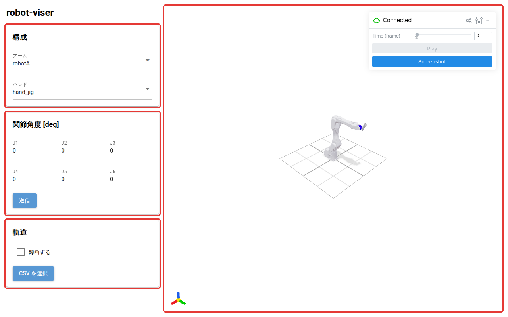

- `robot-viser.exe` を起動すると、ブラウザで画面が開く（単体の exe は 30〜60 秒かかる）
- 左が **操作パネル**、右が **3D ビューア**

---

## 2. 3D の視点を変える

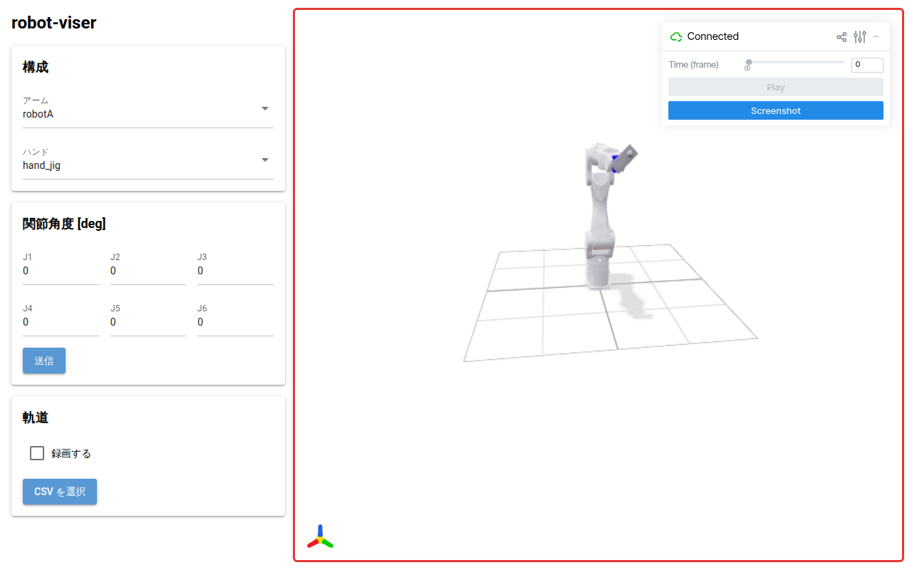

- **3D ビューア** の上でホイールを回すと拡大・縮小
- 左ボタンでドラッグすると回転
- 画像の保存（12）は、この視点のまま撮られる

---

<!-- header: 構成 -->

## 3. アームを選ぶ

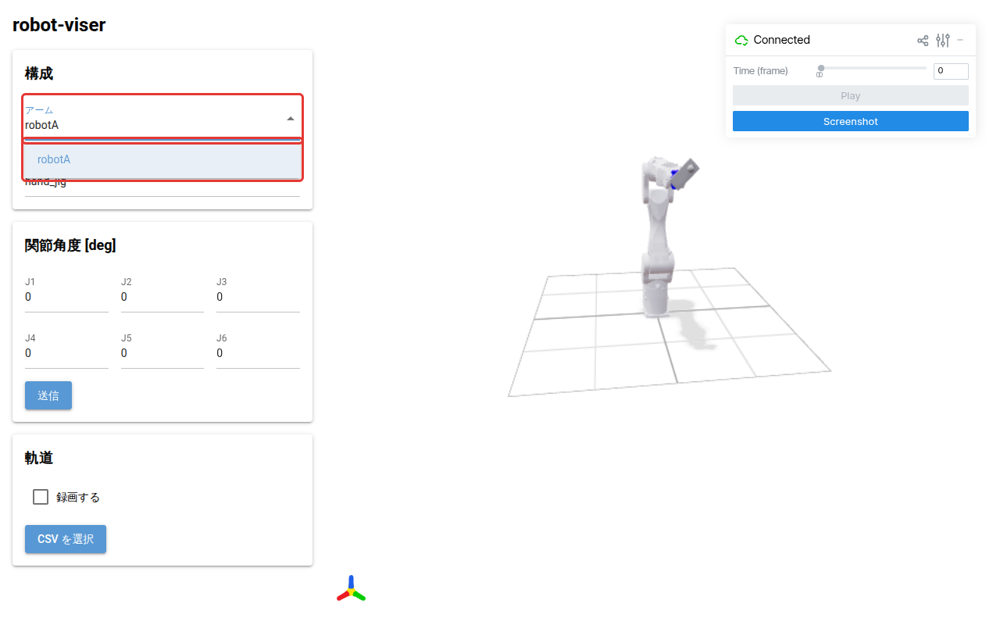

- **アーム** の欄を押して一覧から選ぶ
- 選ぶとすぐ 3D の表示が切り替わる
- 切り替えには数秒かかる

---

## 4. ハンドを選ぶ

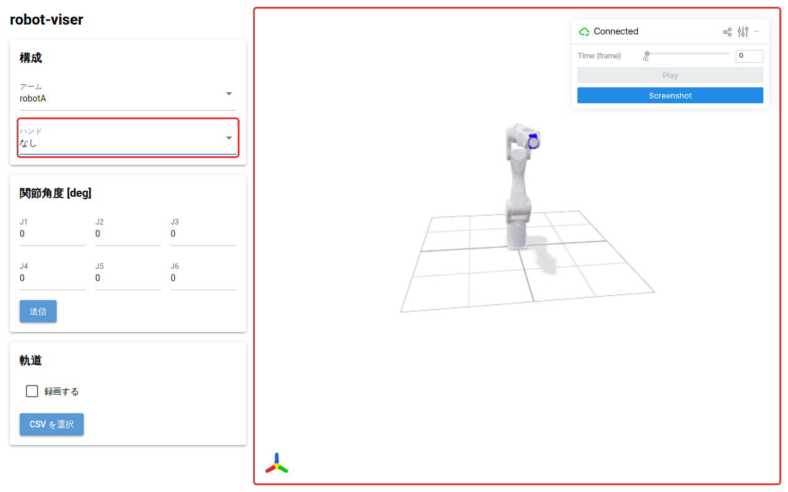

- **ハンド** の欄から選ぶ
- 「なし」を選ぶとアームだけになる
- 軌道の再生中に切り替えると、再生は止まる

---

<!-- header: 関節角度 -->

## 5. 関節角度を入れる

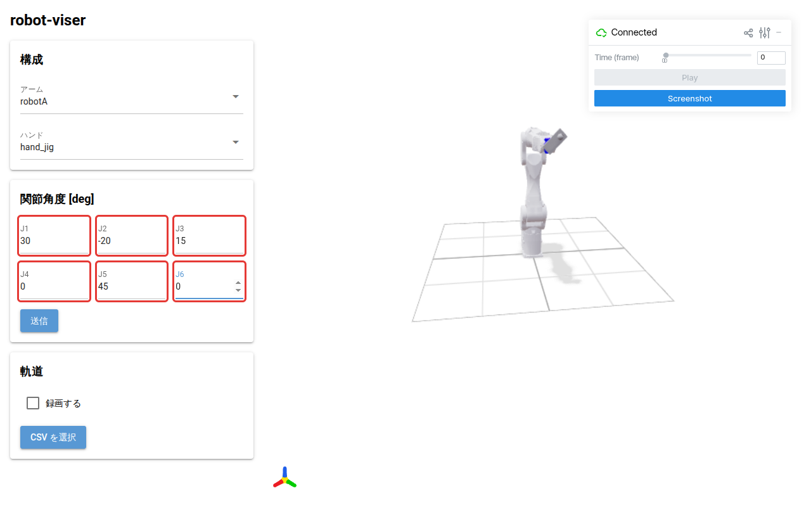

- **J1〜J6** に角度を度（deg）で入れる
- 入れただけでは 3D の表示は変わらない

---

## 6. 送信する

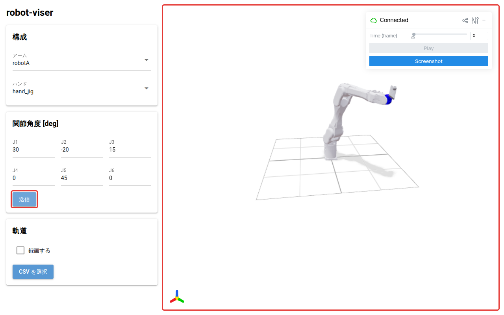

- **送信** を押す
- 入れた角度の姿勢に **3D ビューア** が変わる

---

<!-- header: 軌道 -->

## 7. 軌道 CSV を読み込む

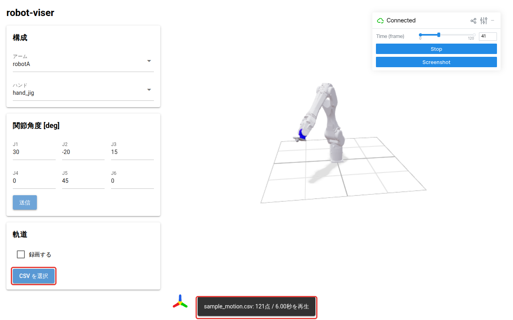

- **CSV を選択** を押してファイルを選ぶ
- すぐ再生が始まり、**点数と再生時間** が下に出る
- CSV の形式は付録を参照

---

## 8. 再生を止める・動かす

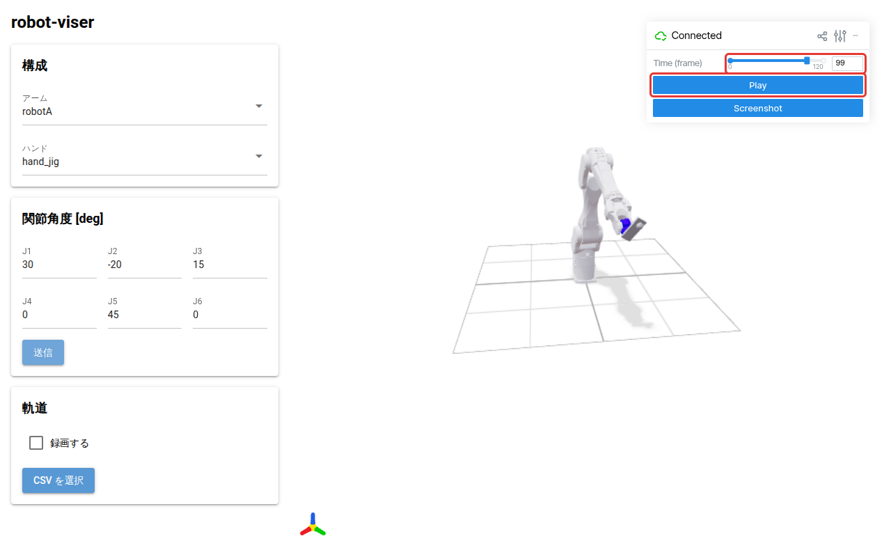

- 再生中は **Stop**、止まると **Play** になる
- **Time (frame)** を動かすと、その時刻の姿勢で止まる
- Play は今の位置から再生する（末尾なら先頭から）

---

<!-- header: 軌道｜録画 -->

## 9. 録画の設定をする

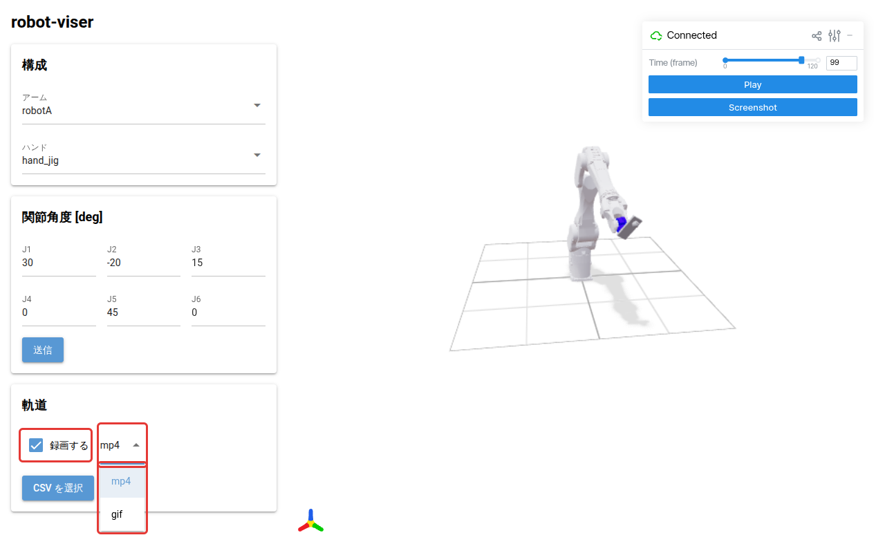

- **録画する** にチェックを入れる
- 右に出る欄で **形式** を選ぶ
- gif は書き出しが遅く、解像度は画面の半分になる

---

## 10. 録画する

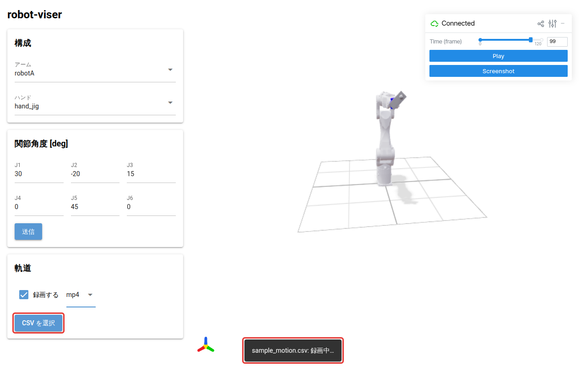

- チェックを入れたまま **CSV を選択** でファイルを選ぶ
- **録画中…** の間、3D はコマ送りで動く
- 画面のタブを表に出したまま待つ

---

## 11. 動画を保存する

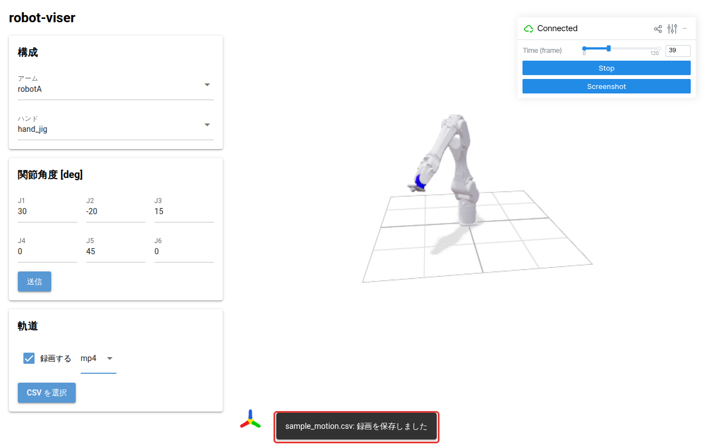

- 終わると **録画を保存しました** と出る
- 動画は `CSV名.mp4`（または `.gif`）でダウンロードされる
- 保存のあと、その軌道が通常どおり再生される

---

<!-- header: 3D ビューア -->

## 12. 3D の画像を保存する

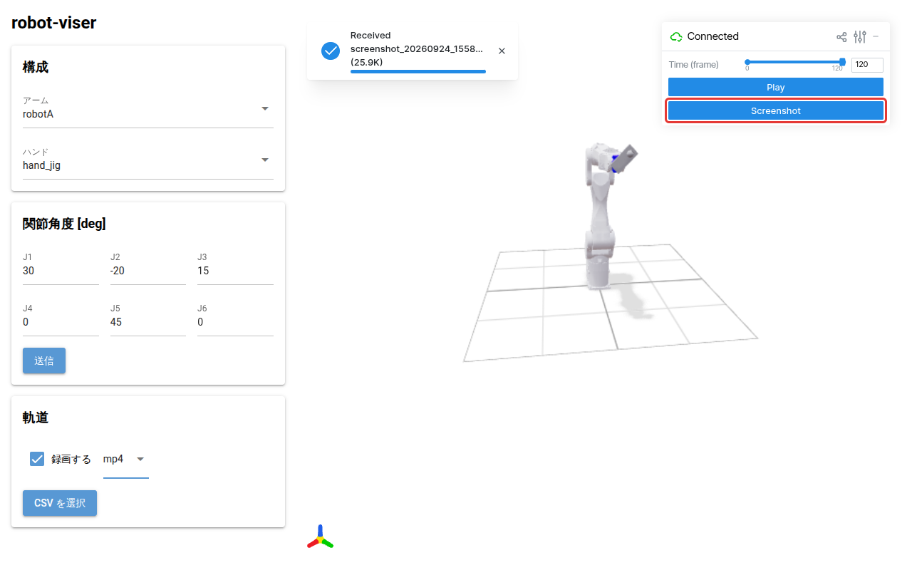

- **Screenshot** を押す
- 今の視点と大きさのまま PNG がダウンロードされる
- ファイル名は `screenshot_日付_時刻.png`

---

<!-- header: 困ったとき -->

## 困ったとき

| 症状 | 確認すること |
|---|---|
| 右側の 3D ビューアが白いまま | 起動の直後なら少し待つ。変わらなければ、ブラウザで `http://127.0.0.1:8081` を直接開けるか確かめる |
| CSV を選んでも何も出ない | CSV の形式を確かめる（付録）。形式が合わないとき、画面には何も表示されない。文字コードは UTF-8 にする |
| 読み込めたが、ほとんど動かない | 角度が度（deg）で書かれているか確かめる。ラジアンの値だと動きがごく小さくなる |
| 録画が終わらない・失敗する | 3D ビューアを表示したタブを表に出しておく。裏に回ると描画が止まり、録画できない |
| 録画の視点が画面と違う | 画面を複数のタブやブラウザで開いていると、最初に開いた画面の視点で録画される。ほかは閉じておく |
| 構成を変えても表示が変わらない | 読み込みに数秒かかる。少し待つ |

---

<!-- header: 付録 -->

## 付録：軌道 CSV の形式

次のどちらかの形式で、文字コードは UTF-8 にします。

| 形式 | 中身 |
|---|---|
| t 形式 | 1 行目が `t,joint1,joint2,joint3,joint4,joint5,joint6`。2 行目から時刻 [秒] と 6 関節の角度 [deg] |
| ロボットログ形式 | 先頭 2 行が情報行、3 行目が列名。`ElapsedTime[msec]` と `Joint(J1)[deg]`〜`Joint(J6)[deg]` の列を使う（ほかの列は読まない）。末尾の終了情報の行は読み飛ばす |

t 形式の例：

```
t,joint1,joint2,joint3,joint4,joint5,joint6
0.0,0,0,0,0,0,0
0.1,1.5,-0.8,0.6,0,2.0,0
```
