<!--
スクリーンショットは scripts/make_manual.py で撮り直せる（README の「使い方マニュアル」を参照）
-->

<!-- _class: cover -->
<!-- _paginate: false -->

# robot-viser<br>使い方マニュアル

6 軸ロボットアームとハンドをブラウザに 3D 表示し、関節角度や軌道で動かすアプリ

2026-09 版

---

## このアプリでできること

| 場所 | できること |
|---|---|
| 構成 | 表示するアームとハンドを選ぶ（ハンドなしも可） |
| 関節角度 [deg] | J1〜J6 の角度を入れて、その姿勢にする |
| 軌道 | 軌道 CSV を読み込んで再生する。動画（mp4 / gif）に録画する |
| 3D ビューア | 視点を変える。再生を止める・動かす。画像を保存する |
| 衝突判定（オプション） | 障害物と、ロボットを包む球を表示する。障害物までの距離をプログラムから取得する |

スクリーンショットの **赤枠** が操作する場所です。

---

<!-- header: はじめに -->

## 1. アプリを開く

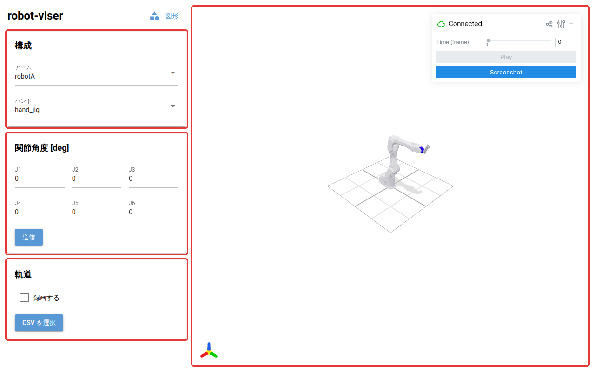

- `robot-viser.exe` を起動すると、ブラウザで画面が開く（単体の exe は 30〜60 秒かかる）
- 左が **操作パネル**、右が **3D ビューア**

---

## 2. 3D の視点を変える

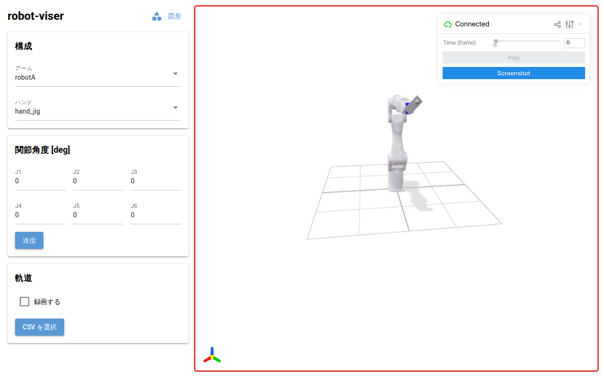

- **3D ビューア** の上でホイールを回すと拡大・縮小
- 左ボタンでドラッグすると回転
- 画像の保存（12）は、この視点のまま撮られる

---

<!-- header: 構成 -->

## 3. アームを選ぶ

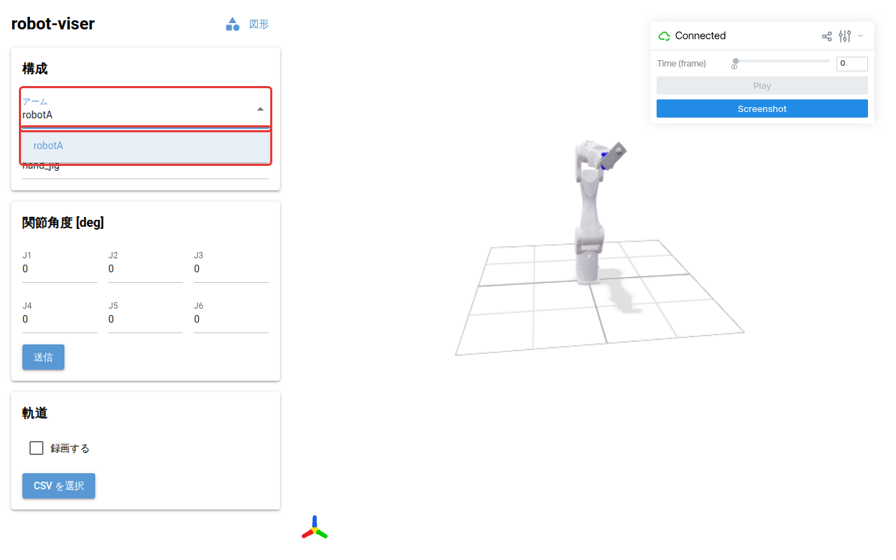

- **アーム** の欄を押して一覧から選ぶ
- 選ぶとすぐ 3D の表示が切り替わる
- 切り替えには数秒かかる

---

## 4. ハンドを選ぶ

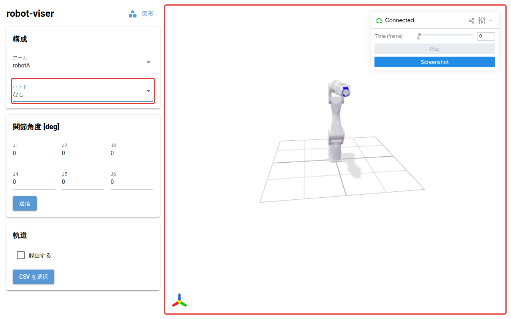

- **ハンド** の欄から選ぶ
- 「なし」を選ぶとアームだけになる
- 軌道の再生中に切り替えると、再生は止まる

---

<!-- header: 関節角度 -->

## 5. 関節角度を入れる

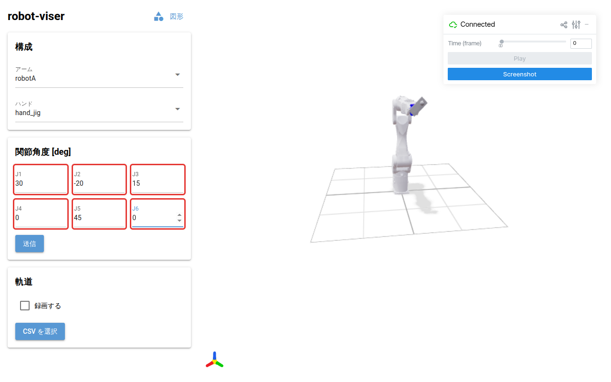

- **J1〜J6** に角度を度（deg）で入れる
- 入れただけでは 3D の表示は変わらない

---

## 6. 送信する

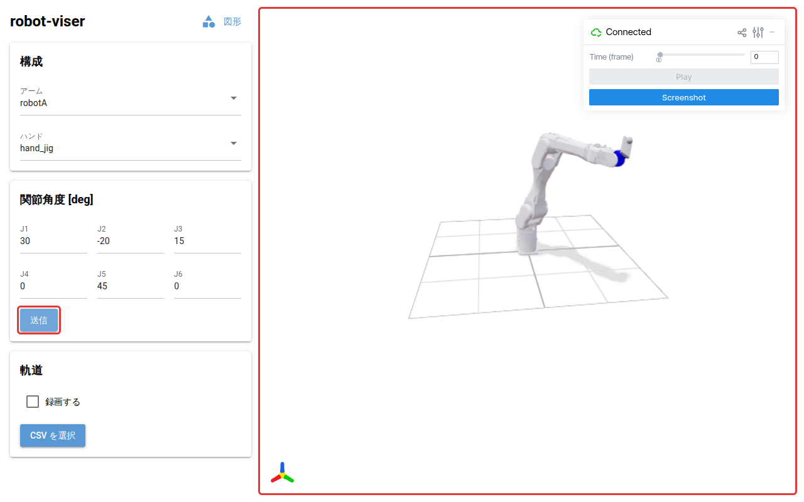

- **送信** を押す
- 入れた角度の姿勢に **3D ビューア** が変わる

---

<!-- header: 軌道 -->

## 7. 軌道 CSV を読み込む

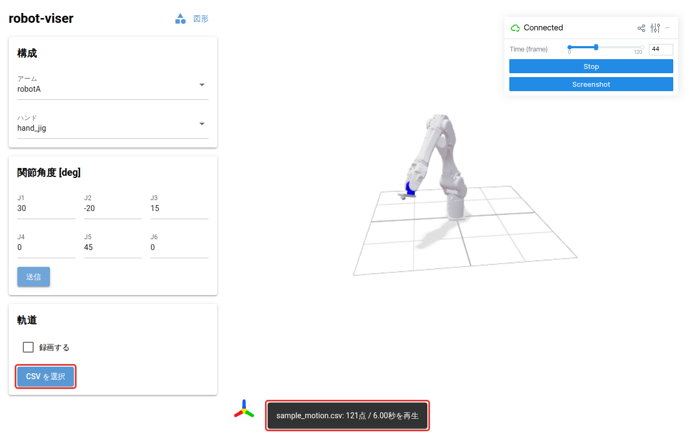

- **CSV を選択** を押してファイルを選ぶ
- すぐ再生が始まり、**点数と再生時間** が下に出る
- CSV の形式は付録を参照

---

## 8. 再生を止める・動かす

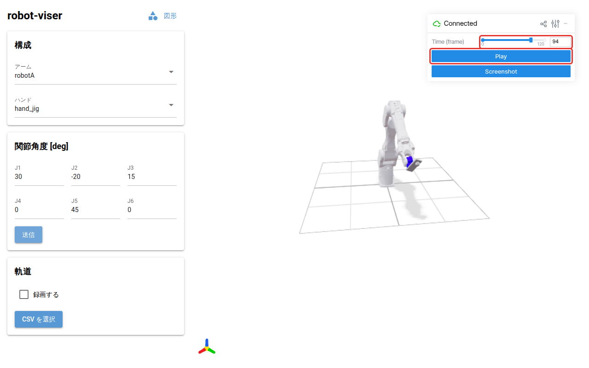

- 再生中は **Stop**、止まると **Play** になる
- **Time (frame)** を動かすと、その時刻の姿勢で止まる
- Play は今の位置から再生する（末尾なら先頭から）

---

<!-- header: 軌道｜録画 -->

## 9. 録画の設定をする

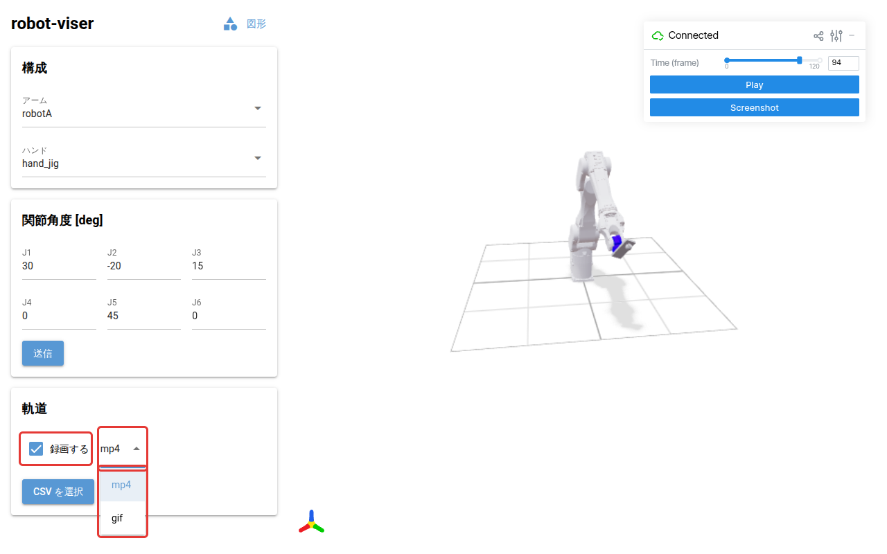

- **録画する** にチェックを入れる
- 右に出る欄で **形式** を選ぶ
- gif は書き出しが遅く、解像度は画面の半分になる

---

## 10. 録画する

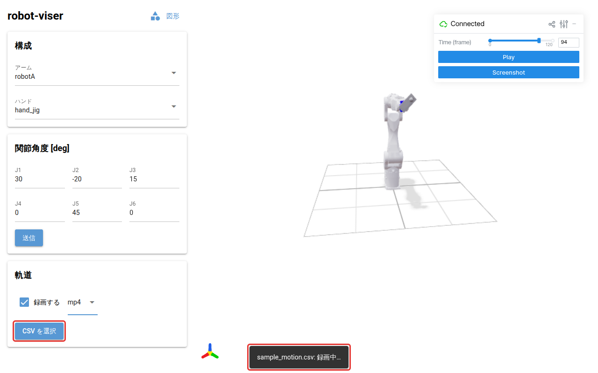

- チェックを入れたまま **CSV を選択** でファイルを選ぶ
- **録画中…** の間、3D はコマ送りで動く
- 画面のタブを表に出したまま待つ

---

## 11. 動画を保存する

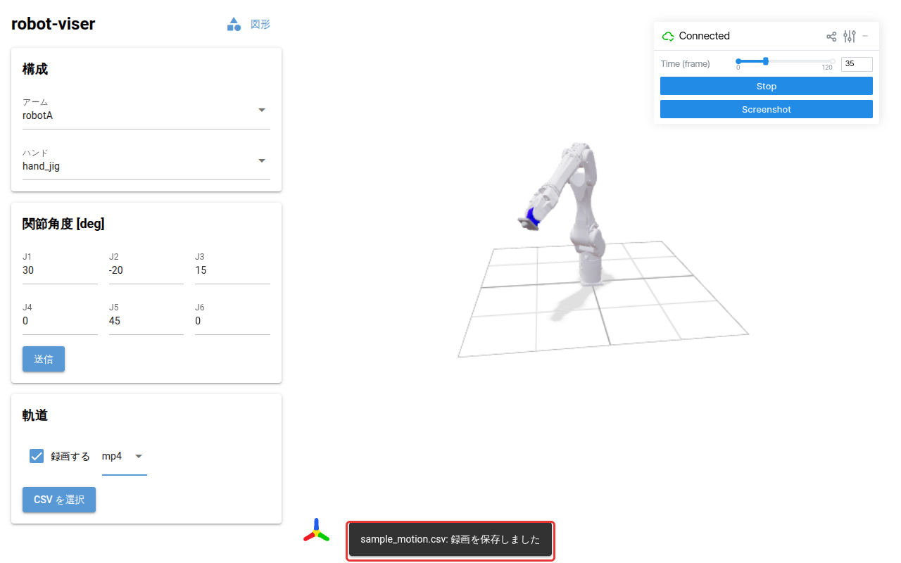

- 終わると **録画を保存しました** と出る
- 動画は `CSV名.mp4`（または `.gif`）でダウンロードされる
- 保存のあと、その軌道が通常どおり再生される

---

<!-- header: 3D ビューア -->

## 12. 3D の画像を保存する

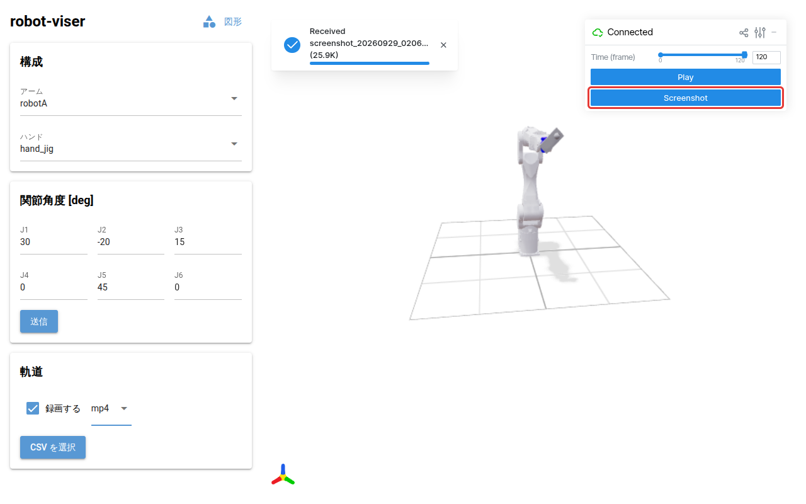

- **Screenshot** を押す
- 今の視点と大きさのまま PNG がダウンロードされる
- ファイル名は `screenshot_日付_時刻.png`

---

<!-- header: 衝突判定（オプション） -->

## 13. 衝突判定を有効にして起動する

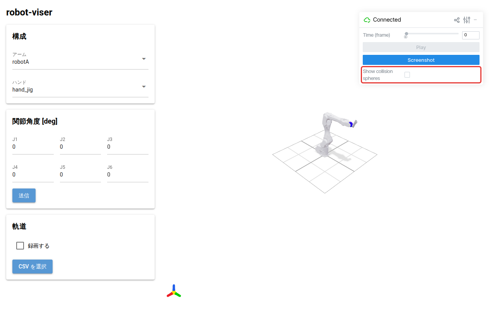

- `robot-viser.exe --collision` のように、`--collision` を付けて起動する
- 3D ビューアに **Show collision spheres**（近似球の表示）が出る
- 付けずに起動したときは、今までと同じ画面になる

---

## 14. 障害物を確認する

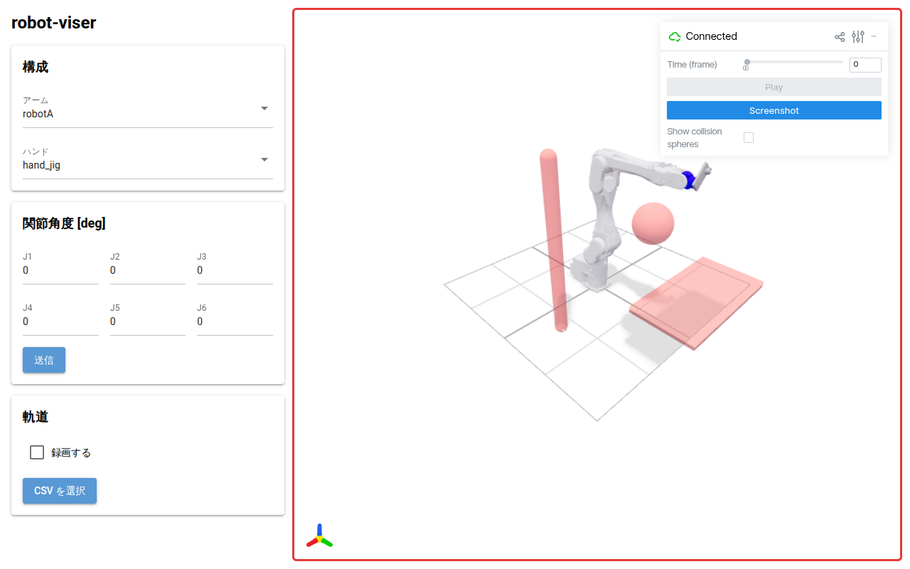

- 登録した障害物が **3D ビューア** に赤の半透明で出る
- 障害物は画面からは登録できない。登録の方法は付録を参照
- 登録し直すと、前の障害物は消えて置き換わる

---

## 15. 近似球を表示する

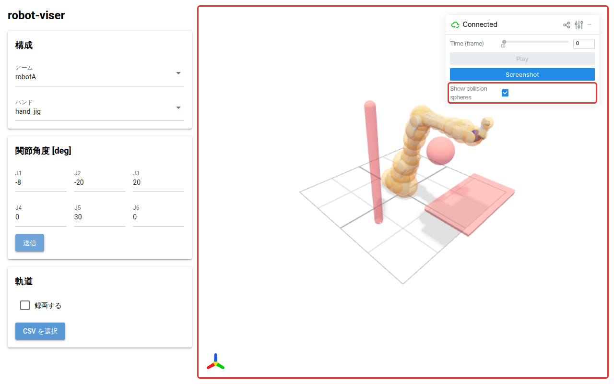

- **Show collision spheres** にチェックを入れる
- 距離の計算に使う、ロボットを包むオレンジの球が出る
- 関節角度を送信したり軌道を再生したりすると、球も一緒に動く

---

<!-- header: 困ったとき -->

## 困ったとき

| 症状 | 確認すること |
|---|---|
| 右側の 3D ビューアが白いまま | 起動の直後なら少し待つ。変わらなければ、ブラウザで `http://127.0.0.1:8081` を直接開けるか確かめる |
| CSV を選んでも何も出ない | CSV の形式を確かめる（付録）。形式が合わないとき、画面には何も表示されない。文字コードは UTF-8 にする |
| 読み込めたが、ほとんど動かない | 角度が度（deg）で書かれているか確かめる。ラジアンの値だと動きがごく小さくなる |
| 録画が終わらない・失敗する | 3D ビューアを表示したタブを表に出しておく。裏に回ると描画が止まり、録画できない |
| 録画の視点が画面と違う | 画面を複数のタブやブラウザで開いていると、最初に開いた画面の視点で録画される。ほかは閉じておく |
| 構成を変えても表示が変わらない | 読み込みに数秒かかる。少し待つ |
| Show collision spheres がない | `--collision` を付けて起動したか確かめる |

---

<!-- header: 付録 -->

## 付録：軌道 CSV の形式

次のどちらかの形式で、文字コードは UTF-8 にします。

| 形式 | 中身 |
|---|---|
| t 形式 | 1 行目が `t,joint1,joint2,joint3,joint4,joint5,joint6`。2 行目から時刻 [秒] と 6 関節の角度 [deg] |
| ロボットログ形式 | 先頭 2 行が情報行、3 行目が列名。`ElapsedTime[msec]` と `Joint(J1)[deg]`〜`Joint(J6)[deg]` の列を使う（ほかの列は読まない）。末尾の終了情報の行は読み飛ばす |

t 形式の例：

```
t,joint1,joint2,joint3,joint4,joint5,joint6
0.0,0,0,0,0,0,0
0.1,1.5,-0.8,0.6,0,2.0,0
```

---

## 付録：障害物を登録する

`--collision` を付けて起動した状態で、プログラムや `curl` から送ります。座標はロボットの根元（床の中心）が原点で、単位は m です。

```bash
curl -X POST localhost:8000/obstacles -H 'Content-Type: application/json' -d '{"obstacles": [
  {"type": "box",     "name": "table", "center": [0, 1.0, 0.4], "size": [0.9, 0.5, 0.05]},
  {"type": "sphere",  "name": "ball",  "center": [0.35, 0.8, 1.0], "radius": 0.12},
  {"type": "capsule", "name": "pole",  "p1": [0.6, 0.2, 0], "p2": [0.6, 0.2, 1.3], "radius": 0.05}]}'
```

| type | 形 | 書く項目 |
|---|---|---|
| `box` | 直方体 | 中心 `center`、各辺の長さ `size`、傾き `rpy`（roll・pitch・yaw [rad]、省略すると傾きなし） |
| `sphere` | 球 | 中心 `center`、半径 `radius` |
| `capsule` | 柱（両端が丸い） | 両端の中心 `p1`・`p2`、半径 `radius` |

Windows のコマンドプロンプトでは `'` が使えないため、`"` を `\"` にして全体を `"` で囲みます。

---

## 付録：障害物までの距離を取得する

関節角度 [deg] を送ると、その姿勢での距離が返ります。3D ビューアのロボットの姿勢は変わりません。

```bash
curl -X POST localhost:8000/distances -H 'Content-Type: application/json' -d '{"angles": [-8, -20, 20, 0, 30, 0]}'
```

| 返ってくる項目 | 意味 |
|---|---|
| `min_distance` | ロボットと障害物のいちばん近い距離 [m]。めり込んでいるとマイナス |
| `control_points` | ロボットを包む球ごとの、中心の位置・半径・ヤコビアン（関節角度 [rad] を動かしたときの中心の動き） |
| `pairs` | 球と障害物の組み合わせごとの距離 `distance` と、障害物から離れる向き `normal` |

`"max_distance": 0.1` を加えると、距離が 0.1 m 以下の組み合わせだけが返ります。
